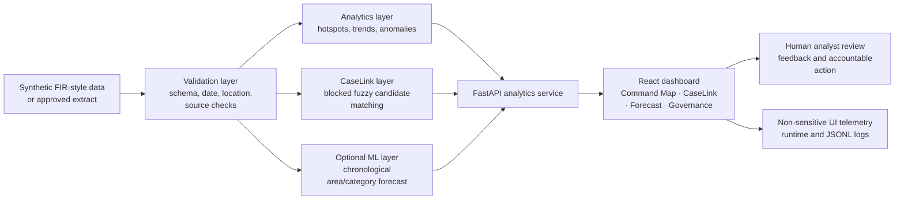
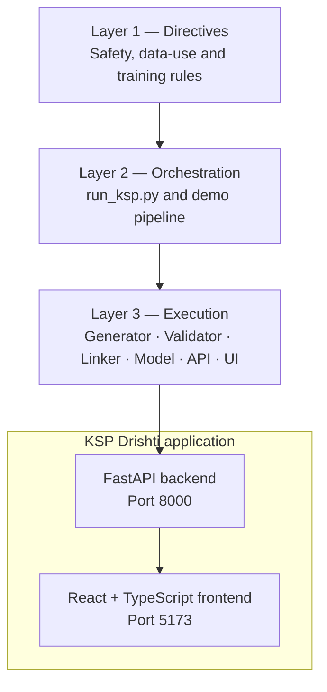

# KSP Drishti

### Evidence-Aware AI Crime Analytics & Visualisation Platform

> **Datathon 2026 · Challenge 02 — AI-Driven Crime Analytics & Visualisation Platform**
> Developed by **Himanshu Yadav and Team** for the **Karnataka State Police and Zoho Datathon**

KSP Drishti is a full-stack decision-support prototype that transforms fragmented FIR-style records into understandable, map-first intelligence. It combines hotspot detection, district drilldowns, trend alerts, candidate case-link analysis, contextual associations, and advisory risk ranges in one accountable dashboard.

**It is designed to assist human analysts—not replace them.** Every included record is synthetic; candidate links require review; and the platform forecasts reported incident patterns by place and category, never the future behaviour of an individual.

---

## Table of contents

- [Competition context](#competition-context)
- [Problem statement](#problem-statement)
- [Our solution](#our-solution)
- [Key features](#key-features)
- [How it works](#how-it-works)
- [Technology stack](#technology-stack)
- [Dataset and data safety](#dataset-and-data-safety)
- [System requirements](#system-requirements)
- [Quick start](#quick-start)
- [Expected output](#expected-output)
- [Project structure](#project-structure)
- [Testing and logs](#testing-and-logs)
- [Future advancements](#future-advancements)
- [Important limitations](#important-limitations)

---

## Competition context

This project addresses **Challenge 02: AI-Driven Crime Analytics & Visualisation Platform** from the Karnataka State Police and Zoho Datathon.

The challenge calls for a modern platform that turns siloed records and manual reporting into actionable intelligence. Required capabilities include interactive dashboards and geospatial maps, hotspot detection, district-level analysis, trend alerts, network/link analysis, repeat-pattern tracking, socio-economic correlation, predictive risk scoring, and AI/ML pattern detection.

KSP Drishti covers those capabilities while adding one important differentiator: a **Data Credibility Lens**. It shows the basis and quality of an alert rather than presenting an AI output as unquestionable truth.

## Problem statement

Police information systems contain valuable FIR, station, crime-head, case-status, legal-section, victim, accused, and investigation records. In many real operating environments, however, those records are fragmented across systems and stations, inconsistently structured, and converted into static reports manually.

This makes it difficult to answer practical questions quickly:

- Which station areas show a meaningful recent increase in a specific crime type?
- Is an alert supported by citizen/victim reporting, police-observed activity, or a weak data sample?
- Are two cases across districts likely to be related and worth an analyst’s review?
- What reported incident patterns need preparation next week, and how confident should the operator be?

A conventional dashboard alone is not enough. It can hide data gaps, imply causation from correlation, or turn uncertain identity matches into false certainty. The real problem is to create faster intelligence **without sacrificing explainability, privacy, fairness, or human accountability**.

## Our solution

KSP Drishti converts FIR-style data into a responsible intelligence workflow:

1. Generate or ingest approved records.
2. Validate dates, geography, required columns, source types, and basic quality rules.
3. Produce transparent place/category hotspots and trend anomalies.
4. Create evidence-backed candidate links for analyst review—not automatic identity decisions.
5. Show advisory, place-based risk ranges with drivers and confidence cues.
6. Capture non-sensitive user actions and operational feedback in an audit-friendly log.

### What makes it different

| Typical analytics demo | KSP Drishti approach |
| --- | --- |
| Shows a heatmap only | Shows hotspots, evidence, source mix, trend context, and data credibility |
| Treats matching records as the same person | Labels every link as `Candidate — Review Required` |
| Predicts “criminals” | Forecasts reported incident patterns by **area and category** only |
| Presents correlations as causes | Clearly labels rainfall/festival/context indicators as descriptive, non-causal associations |
| Uses a black-box model | Uses explainable features, chronological validation, model notes, and an audit view |

## Key features

| Feature | What it delivers |
| --- | --- |
| **Command Map** | Filterable Karnataka district/station view with grid-based hotspot visualisation and KPIs |
| **Hotspot detection** | Current 28-day versus prior 28-day station-area activity scoring |
| **District drilldowns** | District and crime-head filters across all dashboard analytics |
| **Trend and anomaly alerts** | Weekly observed-versus-expected view using a transparent rolling baseline |
| **Data Credibility Lens** | Source mix, freshness, confidence, and caveats beside each intelligence output |
| **CaseLink network** | Cross-district candidate case links with supporting evidence and review status |
| **Repeat-pattern tracking** | Synthetic case-history summaries after an analyst-reviewed link workflow |
| **Risk Forecast** | Advisory next-week reported-incident ranges, not deterministic claims |
| **Contextual associations** | Festival, rainfall, and reporting-source patterns with a non-causal warning |
| **Governance view** | Model card, audit concept, access-control intent, and guardrails |
| **Live activity logging** | Terminal service logs plus non-sensitive frontend telemetry in JSONL format |

## How it works

### End-to-end flow



### Three-layer solution architecture



### Core analytical methods

| Component | Method | Output |
| --- | --- | --- |
| Hotspot scoring | Recent 28-day count compared with preceding 28 days | Bounded advisory hotspot score |
| Trend detection | Weekly resampling and trailing four-week expected level | Observed/expected trend and anomaly flag |
| CaseLink | Explainable blocking plus name similarity, age proximity, and modus-operandi signal | Candidate review queue only |
| Forecast model | Chronological station-area/category feature set and `HistGradientBoostingRegressor` | Next-week reported incident range |
| Context analysis | Descriptive rainfall, festival, and source-mix comparison | Caveated association cards |

## Technology stack

| Layer | Libraries / tools | Why it is used |
| --- | --- | --- |
| Data generation and validation | Python standard library, `pandas`, `numpy` | Deterministic synthetic data, quality checks, and analytics |
| Machine learning | `scikit-learn`, `joblib` | Compact CPU-friendly tabular forecasting model and model storage |
| Backend API | `FastAPI`, `Pydantic`, `Uvicorn` | Typed routes, request validation, OpenAPI documentation, fast local serving |
| Frontend | React, TypeScript, Vite | Responsive interactive dashboard with type safety and fast builds |
| Visualisation | Native SVG and CSS | Offline-friendly visualisation without an external map API key |
| Development and deployment | `pnpm`, Docker, Docker Compose | Reproducible frontend dependencies and optional container deployment |
| Verification | `pytest` (optional) | Automated data-pipeline checks |

## Dataset and data safety

### Included prototype dataset

The project generates `data/synthetic/cases.csv` locally using a fixed seed. It contains approximately 3,470 **clearly synthetic** FIR-style records across these demonstration districts:

- Bengaluru Urban
- Mysuru
- Hubballi-Dharwad
- Mangaluru
- Kalaburagi

The synthetic dataset includes crime category, dates, district, station, approximate coordinates, case status, reporting source, synthetic modus-operandi text, contextual variables, and deliberately repeated aliases for safe CaseLink demonstrations. It does **not** impersonate real people.

### Data rules

- Never upload confidential FIR data or PII to public Google Colab.
- Do not use caste, religion, health, arrest, surrender, or chargesheet outcome as risk-model features.
- Candidate identity links must be reviewed by an authorised analyst.
- Production data requires written KSP approval, least-privilege access, retention controls, encryption, and a security review.

See [the layer-wise dataset and training guide](docs/3_Layer_Wise_Implementation.md) for the real-data migration path.

## System requirements

| Requirement | Recommended |
| --- | --- |
| Operating system | Windows 10/11, macOS, or Linux |
| Python | Python 3.11+ (3.12 supported) |
| Node.js | Node.js 20+ with npm or pnpm |
| Memory | 4 GB minimum; 8 GB recommended |
| Disk space | 2 GB free space for dependencies and generated artefacts |
| Browser | Recent Chrome, Edge, or Firefox |
| Network | Required only during the first dependency install; the demo itself uses local synthetic data |

No GPU is required. The included tabular model is CPU-friendly and normally trains in minutes. A T4 GPU is useful only for a future, separately validated NLP extension.

## Quick start

### 1. Open PowerShell in the project folder

```powershell
cd E:\Competition\Datathon
```

### 2. Run the single launcher

```powershell
python run_ksp.py
```

If your Windows installation uses the Python launcher instead:

```powershell
py -3 run_ksp.py
```

The launcher will:

1. introduce the project, team, objective, and safety guardrails;
2. ask before installing dependencies;
3. create `.venv` when needed;
4. generate, validate, and link synthetic records;
5. optionally train the forecasting model;
6. start FastAPI at `http://127.0.0.1:8000`;
7. start the dashboard at `http://127.0.0.1:5173`;
8. open the dashboard in a browser and stream backend/frontend activity in the terminal.

Press `Ctrl+C` to stop the services safely.

### Useful launcher commands

```powershell
# Prepare dependencies and demo data only
python run_ksp.py --prepare-only

# Train the optional forecasting model before starting the dashboard
python run_ksp.py --train

# No prompts and no browser opening; useful for automation
python run_ksp.py --non-interactive --no-browser
```

### Manual run (for developers)

```powershell
python -m venv .venv
.\.venv\Scripts\Activate.ps1
pip install -r backend\requirements.txt
python execution\run_demo_pipeline.py
python -m uvicorn app.main:app --app-dir backend --reload
```

In a second terminal:

```powershell
cd E:\Competition\Datathon\frontend
npm install
npm run dev
```

Open the dashboard at `http://localhost:5173`. Interactive API documentation is available at `http://localhost:8000/docs`.

## Expected output

After a successful launch, you should see:

- a live React dashboard with four views: **Command Map**, **CaseLink**, **Risk Forecast**, and **Governance**;
- district/category filters, hotspot cards, weekly trends, and source-credibility indicators;
- a CaseLink graph and candidate-review table;
- advisory area/category forecast ranges and interpretable drivers;
- terminal logs for server startup, API requests, and frontend interactions;
- `logs/ksp_runtime_<timestamp>.log` for the launcher session;
- `logs/frontend_events.jsonl` for non-sensitive UI events;
- generated data under `data/synthetic/` and optional model artefacts under `data/models/`.

## Project structure

```text
Datathon/
├── run_ksp.py                    # Single interactive launcher
├── README.md                     # This project guide
├── backend/
│   ├── app/main.py               # FastAPI routes and telemetry contract
│   ├── app/services/analytics.py # Analytics, data loading, logging
│   └── requirements.txt          # Python runtime dependencies
├── frontend/
│   └── src/                      # React dashboard, API client, styles, fallback data
├── execution/
│   ├── generate_synthetic_data.py
│   ├── validate_dataset.py
│   ├── build_link_candidates.py
│   ├── train_risk_model.py
│   └── run_demo_pipeline.py
├── directives/                   # Safety and training SOPs
├── data/                         # Generated synthetic records and optional models
├── docs/                         # Detailed submission documentation
├── notebooks/                    # Google Colab-compatible notebook
├── tests/                        # Data pipeline tests
└── logs/                         # Generated runtime and UI telemetry logs
```

## Testing and logs

Run the data-pipeline tests after setup:

```powershell
.\.venv\Scripts\python.exe -m pip install -r requirements-dev.txt
.\.venv\Scripts\python.exe -m pytest tests -q
```

The generated artefacts (`data/synthetic`, model files, virtual environment, logs, and frontend build/cache files) are excluded through `.gitignore` so source control stays clean.

## Future advancements

KSP Drishti is a hackathon prototype. A trustworthy production rollout should be phased and governed—not rushed.

### Phase 1 — Approved data and secure operations

- Build a read-only, schema-mapped connector for approved KSP extracts.
- Add authoritative user identity, district/station RBAC, encrypted storage, retention policy, and immutable audit records.
- Replace the visual grid with approved PostGIS/H3 geospatial storage and official boundaries.
- Establish data-quality dashboards for missing geocodes, late reporting, duplicate cases, and category drift.

### Phase 2 — Better intelligence quality

- Evaluate entity resolution with stronger authorised identifiers and tools such as Splink; retain mandatory human review.
- Add multilingual Kannada/English FIR narrative support only after privacy review and labelled-data evaluation.
- Calibrate forecasting against public aggregate data and approved historical extracts.
- Add model monitoring for accuracy, drift, missingness, geographic coverage, and disparate error rates.

### Phase 3 — Controlled field adoption

- Introduce analyst feedback workflows with reason codes and supervisory review.
- Add alert delivery to authorised operational channels, never automated enforcement.
- Run shadow-mode evaluation before any operational reliance.
- Publish model cards, change logs, independent audits, and periodic performance reviews.

## Important limitations

- This is a **synthetic-data prototype**, not a production police system.
- Forecasts describe patterns in **reported records**, which may differ from underlying crime incidence.
- Contextual associations do not prove causation.
- Candidate links are not verified identities.
- No dashboard result should independently trigger surveillance, arrest, patrol allocation, or adverse action.

## Documentation

- [Project overview and elaborated problem statement](docs/1_Project_Overview.md)
- [Technical architecture, API contract, and operating guide](docs/2_Technical_Architecture.md)
- [Layer-wise solution, libraries, dataset strategy, and model-training guide](docs/3_Layer_Wise_Implementation.md)

---

Built with the principle: **use AI to make public-safety data easier to understand, while keeping human accountability at the centre.**
